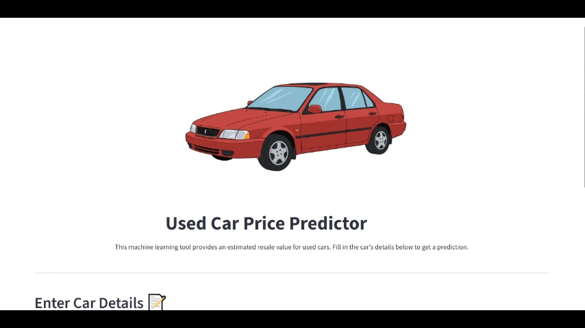

# 🚗 Used Car Price Predictor


An end-to-end data science project that predicts the resale value of used cars. This interactive web application allows users to input key vehicle specifications and receive an instant price estimate powered by a trained machine learning model.

---

## ✨ Live Demo

### [**>> Try the live app here! <<**](https://used-car-price-predictor-by-tahir.streamlit.app/)  



---

## 🚀 Project Overview & Features

This project demonstrates a complete machine learning pipeline, from initial data exploration to the deployment of a user-friendly web application.

-   **Interactive UI:** A clean and modern interface built with Streamlit where users can input car details.
-   **Instant Price Prediction:** Get real-time price estimates based on the model's analysis.
-   **Data-Driven Insights:** The model was trained on a comprehensive dataset of used car sales, learning the relationships between features like age, mileage, and present price.
-   **Full Project Lifecycle:** Covers every stage of a data science project:
    -   Data Cleaning and Preprocessing
    -   Exploratory Data Analysis (EDA)
    -   Feature Engineering
    -   Model Training and Evaluation
    -   Deployment as a Web Application

---

## 🛠️ Tech Stack & Methodology

-   **Data Source:** The project utilizes the [Used Car Price Prediction Dataset](https://www.kaggle.com/datasets/pushpakhinglaspure/used-car-price-prediction) from Kaggle, containing sales data for over 300 used cars.
-   **Data Analysis & Preprocessing (EDA):**
    -   Performed using **Pandas** for data manipulation and **Seaborn/Matplotlib** for visualization in a Jupyter Notebook.
    -   **Key Insights:** EDA revealed a strong positive correlation between `Present_Price` and `Selling_Price`, and a negative correlation with `Car_Age`. It also highlighted that the dataset contained both cars and motorcycles, justifying the removal of the `Car_Name` feature for a more focused model.
    -   **Feature Engineering:** A `Car_Age` feature was engineered from the `Year` column to provide a more intuitive and powerful predictor for the model.
-   **Model Training & Evaluation:**
    -   Multiple regression models were trained using **Scikit-learn** and **XGBoost**, including Linear Regression, Random Forest, and XGBoost Regressor.
    -   The models were evaluated based on their R-squared (R²) score and Mean Absolute Error (MAE).
    -   The **XGBoost Regressor** was selected as the final model due to its superior performance, achieving an **R² score of 0.96**.
    -   The trained model was saved as `xgb_model.pkl` using `pickle`.
-   **Frontend & Deployment:**
    -   The user interface is built entirely with **Streamlit**.
    -   The application is deployed on **Streamlit Cloud**, directly linked to this GitHub repository for seamless updates.

---

## 💻 Running the Project Locally

To run this project on your own machine, follow these steps:

1.  **Clone the repository:**
    ```bash
    git clone https://github.com/MuhammadTahir-1-9-4/Used-Car-Price-Predictor.git
    cd Used-Car-Price-Predictor
    ```

2.  **Set up a virtual environment (recommended):**
    ```bash
    python -m venv venv
    # On Windows
    venv\Scripts\activate
    # On macOS/Linux
    source venv/bin/activate
    ```

3.  **Install the required libraries:**
    ```bash
    pip install -r requirements.txt
    ```

4.  **Run the Streamlit app:**
    ```bash
    streamlit run app.py
    ```
    The application should now be running in your local web browser!

---

## 👤 Contact

Muhammad Tahir - [LinkedIn](https://www.linkedin.com/in/muhammad-tahir-data/)